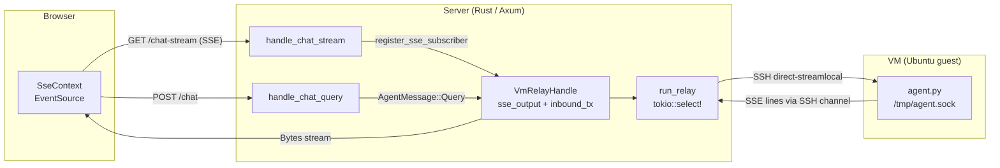
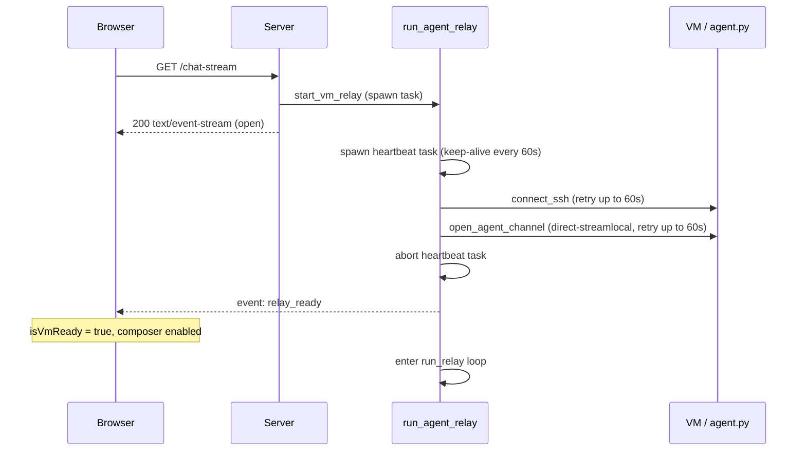
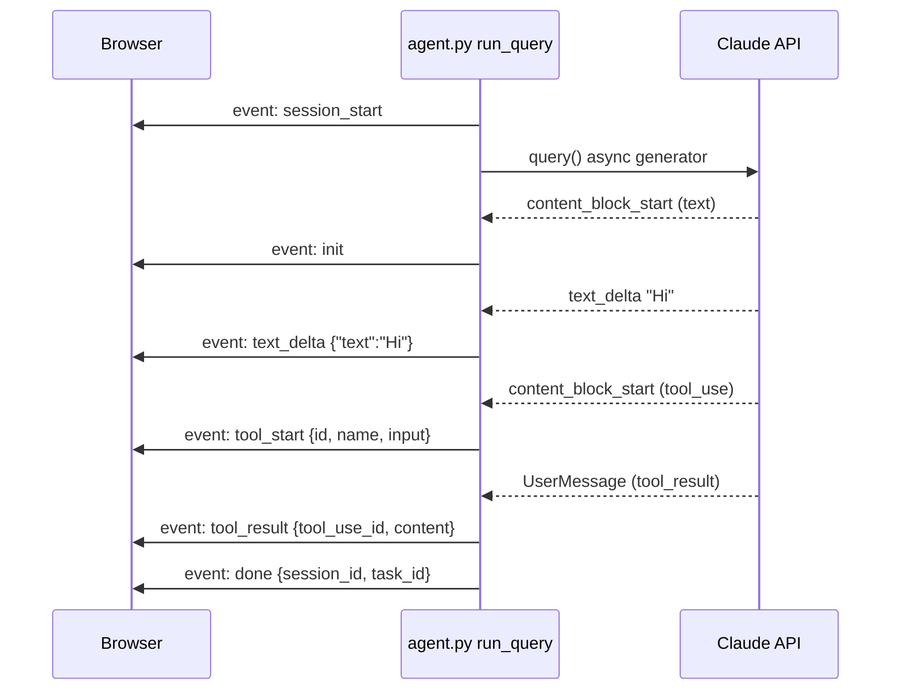
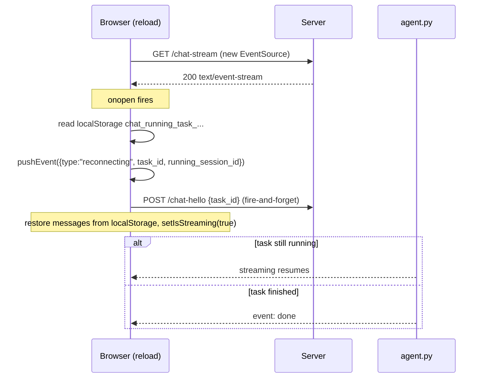
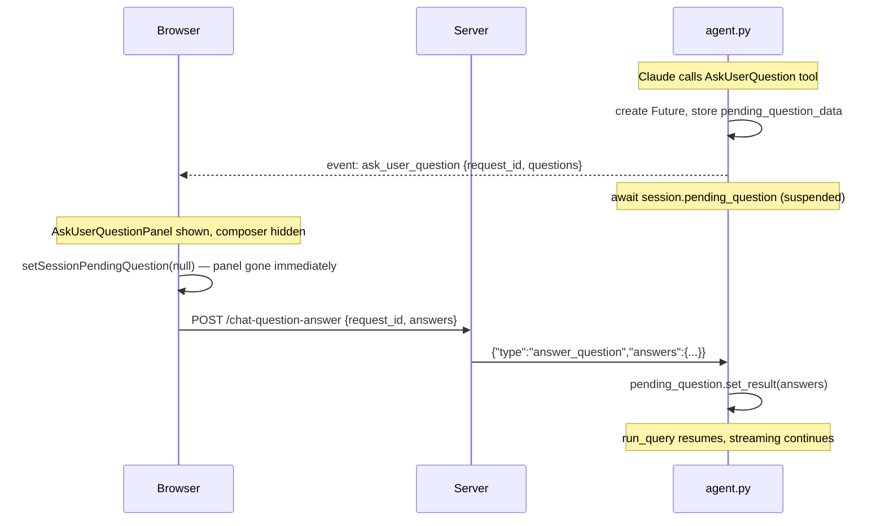

# Chat Architecture: End-to-End Flow

Traces a message from the user pressing Enter through to Claude's response in the browser, and covers concurrent sessions, page refreshes, and reconnects.

---

## System Overview



Three tiers:

1. **Server** (Axum, Rust) — HTTP/SSE router. Authenticates requests, owns a `VmRelayHandle` per VM, proxies bytes between HTTP clients and the relay task.
2. **Relay task** (Rust) — a long-lived Tokio task per VM. Holds a single SSH connection and multiplexes an inbound mpsc channel with outbound bytes from the agent.
3. **Agent daemon** (Python, `agent.py`) — listens on `/tmp/agent.sock`. Runs Claude SDK queries, emits SSE-formatted lines to stdout.

---

## 1. Startup: SSE Connection

`SseProvider` opens `GET /sessions/{vmId}/chat-stream` on mount.

`handle_chat_stream` calls `get_or_create_vm_relay`. If no live relay exists, `start_vm_relay` spawns a Tokio task and returns a `VmRelayHandle` containing:
- `inbound_tx: mpsc::Sender<AgentMessage>` — for POST handlers
- `sse_output: Arc<Mutex<Option<mpsc::Sender<Bytes>>>>` — current SSE subscriber
- `relay_connected: Arc<AtomicBool>`

`register_sse_subscriber` creates a fresh `mpsc::channel::<Bytes>(2)` and stores the sender. If `relay_connected` is already `true`, it immediately sends `relay_ready`.



`relay_ready` sets `isVmReady = true` on the frontend, enabling the composer.

---

## 2. Sending a Message

### 2a. Frontend: `handleSend`

`ChatInterface.handleSend`:

1. `conversationId = viewSessionId` — the currently displayed session (`null` = blank state).
2. `effectiveId = conversationId ?? crypto.randomUUID()` — for blank state, generates a client-side pending ID.
3. Adds a `{ type: "user" }` message to `messagesBySession.get(effectiveId)`.
4. Sets `runningSessionId = effectiveId`, `isStreaming = true`.
5. If `conversationId === null`: sets `viewSessionId = effectiveId` and inserts a `{ session_id: effectiveId, is_pending: true, title: "New chat…" }` placeholder into the sessions list — visible in the sidebar immediately.
6. Calls `sseCtx.sendQuery(text, conversationId)` — sends `null` to the server for new chats.

### 2b. POST /chat

`SseContext.sendQuery` POSTs:

```json
{ "content": "...", "session_id": "abc" | null, "csrf_token": "..." }
```

`handle_chat_query`:
1. Validates and rotates the CSRF token (returns new one in `x-csrf-token`).
2. Generates `task_id = Uuid::new_v4()`.
3. Pushes `AgentMessage::Query { task_id, content, session_id }` into `inbound_tx` (30s timeout).
4. Returns `{ task_id }`.

### 2c. Relay → Agent

`run_relay` picks up the query and writes a JSON line over the SSH channel:

```json
{"type":"query","task_id":"<uuid>","content":"Hello","session_id":"abc"}
```

`agent.py` parses this, spawns `asyncio.create_task(run_query(...))`, and registers the session.

---

## 3. Streaming the Response



`emit_sse` writes `"event: {name}\ndata: {json}\n\n"` to the SSH channel. The relay forwards bytes to the SSE body via `take_live_sse_sender` (which lazily removes closed subscribers).

### Frontend: `SseContext` → `useSseHandlers`

`SseContext` pushes each SSE event into `eventQueueRef` and increments `eventSeq`. `useSseHandlers` drains the whole queue on each `eventSeq` tick, processing events synchronously within one React render.

| SSE event | Action |
|---|---|
| `session_start` | Stores `task_id`; writes `chat_running_task_{vmId}` to localStorage |
| `init` | Adds `{ type: "assistant", isThinking: true }` bubble (animated dots); saves to localStorage |
| `text_delta` | Seals/removes thinking bubble if empty. Appends to accumulating assistant message |
| `thinking_delta` | Appends to thinking message |
| `tool_start` | Adds `{ type: "tool", isToolUse: true }` message |
| `tool_result` | Updates the matching tool message with the result |
| `ask_user_question` | Calls `setSessionPendingQuestion(session, { questions })` |
| `done` | Clears localStorage. If `session_id` differs from the pending ID, migrates messages to the real session slot. Calls `loadHistory()` to refresh the sidebar (replaces the placeholder with the real title) |
| `error_event` | Clears localStorage. Adds `{ type: "error" }` message |

---

## 4. State Management: Multiple Concurrent Sessions

### Session IDs

At any moment the interface tracks:

- **`viewSessionId`** — session whose messages are *displayed*. `null` = blank state.
- **`runningSessionId`** — session currently *streaming*. May differ from `viewSessionId` if the user switches view mid-stream.

New-chat messages accumulate under a client-generated UUID (`pendingId`) until `done` arrives with the real `session_id` from the server.

### `isCurrentRunning` vs `isOtherRunning`

```typescript
const isCurrentRunning = isStreaming && runningSessionId === viewSessionId;
const isOtherRunning   = isStreaming && runningSessionId !== viewSessionId;
```

- `isCurrentRunning` → status bar shown, composer in loading state.
- `isOtherRunning` → a different session is streaming; composer shown but disabled.

### Clicking "New Chat" mid-stream

When the user clicks New Chat while a pending-session stream is running:

1. App creates a new pending `selectedSession` with a fresh UUID → `viewSessionId` changes to the new UUID.
2. The original stream continues under `runningSessionId = pendingId1`.
3. `isCurrentRunning = false` for the new view → status bar hides. `isOtherRunning = true` → composer disabled.
4. The original placeholder row (`pendingId1`) stays in the sidebar with a pulsing indicator.
5. When `done` fires, messages migrate from `pendingId1` to the real `session_id`. `loadHistory()` replaces the placeholder.

### Messages for a non-viewed session

All SSE events route to `runningRef.current`, not `viewSessionId`. When the user returns to the running session, messages are already there.

---

## 5. Page Refresh and Reconnect

### localStorage persistence

On `session_start`:
```
chat_running_task_{vmId} = {"task_id":"...","running_session_id":"...","project_dir":"..."}
```
On each message-mutating SSE event:
```
chat_messages_task_{taskId} = JSON.stringify(messages)
```
Cleared on `done` or `error_event`.

### Reconnect flow



`useSseHandlers` `reconnecting` handler:
- If `running_session_id` is null (legacy format), generates a UUID.
- Deduplicates by `task_id` — `onopen` fires on every EventSource connection so the same event would otherwise be processed twice.
- Restores messages from localStorage immediately; also loads the server transcript.

---

## 6. Ask-User-Question Flow



`handleAnswerQuestion` clears the panel before the `await` so it disappears instantly on tap.

---

## 7. Stopping a Stream

User clicks Stop → `sendStop` POSTs to `/chat-stop` → relay sends `{"type":"interrupt","task_id":"..."}` to the agent → `session.task.cancel()` → `CancelledError` propagates into `run_query`'s `finally` block → emits `done` → frontend clears running state.

---

## 8. Transcript Loading

When the user clicks an existing session, `loadTranscriptForSession` fetches `/chat-transcript?session_id=...&project_dir=...` (skipped if messages already cached). `buildMessagesFromTranscript` converts the `.jsonl` transcript into `ChatMessage[]` for rendering.

---

## 9. Heartbeat

`run_relay` sends `": keep-alive\n\n"` every 60 seconds to prevent proxies from closing the idle SSE connection. Ignored by `EventSource`.
