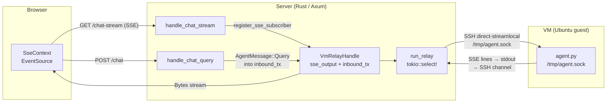
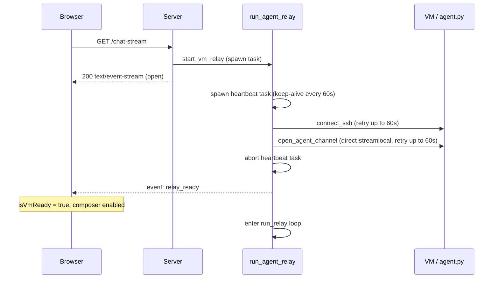
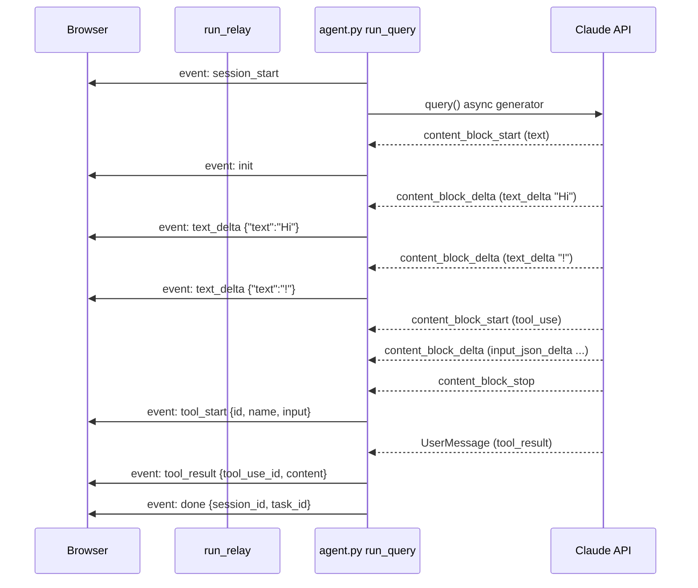
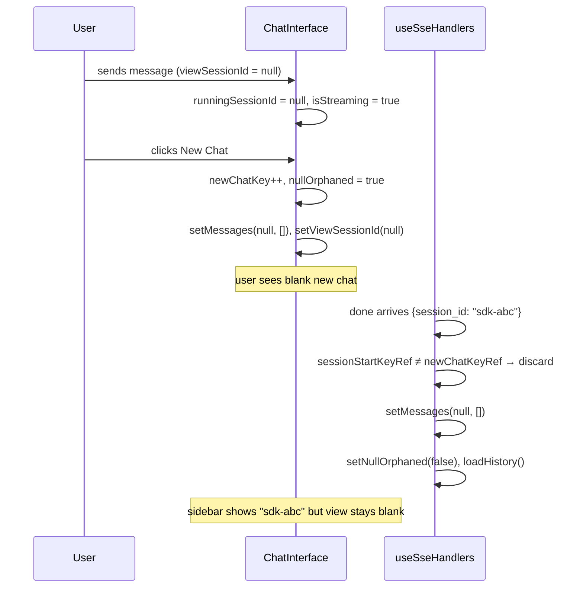
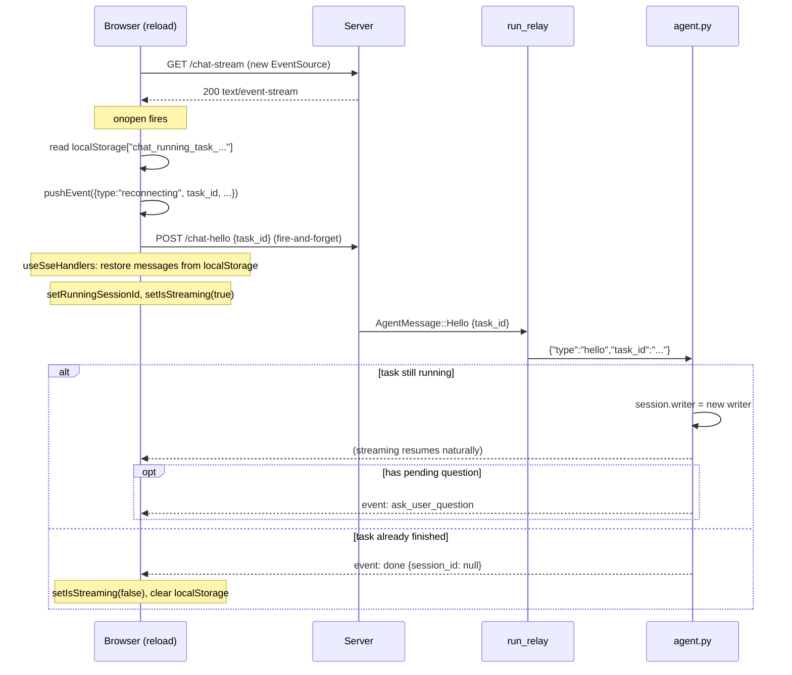
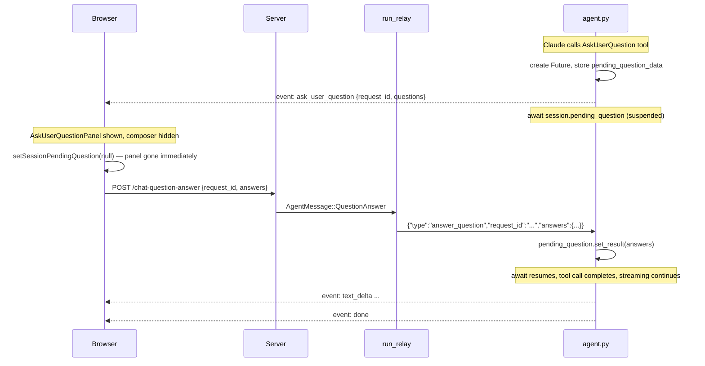
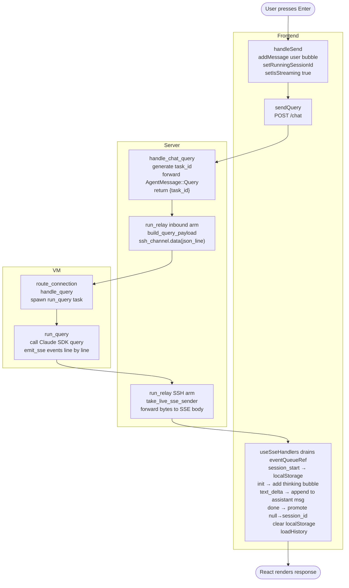

# Chat Architecture: End-to-End Flow

This document traces every message from the moment the user presses Enter through to Claude's response appearing in the browser, and explains how the system handles multiple concurrent sessions, page refreshes, and mid-stream reconnects.

---

## System Overview



There are three tiers:

1. **Server** (Axum, Rust) — HTTP/SSE router. Authenticates requests, owns a `VmRelayHandle` per VM, proxies bytes between HTTP clients and the relay task.
2. **Relay task** (Rust, `chat-relay` crate) — a long-lived Tokio task per VM. Holds a single SSH connection to the VM and multiplexes an inbound mpsc channel (fed by HTTP handlers) with outbound bytes from the agent over the SSH Unix-socket channel.
3. **Agent daemon** (Python, `agent.py`) — listens on `/tmp/agent.sock`. Runs Claude SDK queries in asyncio tasks, emits SSE-formatted lines to its stdout, which the relay reads and forwards to the browser.

---

## 1. Startup: SSE Connection

When the browser loads, `SseProvider` runs a `useEffect` that opens:

```
GET /sessions/{vmId}/chat-stream
```

The handler `handle_chat_stream` calls `get_or_create_vm_relay`:

- If a live `VmRelayHandle` already exists for this VM it is returned as-is.
- Otherwise, `start_vm_relay` is called, which spawns a Tokio task (`run_agent_relay`) and returns a `VmRelayHandle` immediately. The handle contains:
  - `inbound_tx: mpsc::Sender<AgentMessage>` — for POST handlers to push commands
  - `sse_output: Arc<Mutex<Option<mpsc::Sender<Bytes>>>>` — current SSE subscriber
  - `relay_connected: Arc<AtomicBool>` — set to `true` once the SSH channel is open

`VmRelayHandle::register_sse_subscriber` creates a fresh `mpsc::channel::<Bytes>(2)` and stores the sender in `sse_output`. If `relay_connected` is already `true`, it immediately sends the `relay_ready` event into the new channel so the frontend knows the agent is available.

The response is a streaming `text/event-stream` body (`Body::from_stream`) backed by that channel's receiver. Every byte the relay pushes to `sse_output` flows straight to the browser.

### Relay startup



In parallel, `run_agent_relay` runs:

1. Spawns a heartbeat task that sends `": keep-alive\n\n"` every 60 seconds while connecting, to keep the SSE connection alive through proxies.
2. Calls `connect_ssh_and_open_channel`:
   - `connect_ssh` retries for up to 60 seconds until the VM's SSH port accepts the key.
   - `open_agent_channel` opens a `direct-streamlocal@openssh.com` channel to `/tmp/agent.sock` on the VM, retrying for up to 60 seconds while the socket may not exist yet.
3. Aborts the startup heartbeat task.
4. Sets `relay_connected = true` and sends `relay_ready` to whoever is subscribed.
5. Enters `run_relay` — the main select loop.

On the frontend, `SseContext` receives the `relay_ready` SSE event and sets `isVmReady = true`, enabling the composer.

---

## 2. Sending a Message

### 2a. Frontend: `handleSend`

User submits text. `ChatInterface.handleSend`:

1. Records `sessionId = viewSessionId` (the session currently displayed, `null` for a new chat).
2. If `sessionId === null`, snapshots `newChatKey` into `sessionStartKeyRef` (used later to detect if the user navigated away before the response arrived).
3. Immediately adds a `{ type: "user" }` message to `messagesBySession.get(sessionId)` via `addMessage`.
4. Sets `runningSessionId = sessionId` and `isStreaming = true`.
5. Calls `sseCtx.sendQuery(text, sessionId)`.

### 2b. `sendQuery` — POST /chat

`SseContext.sendQuery` POSTs:

```json
{ "content": "...", "session_id": "abc" | null, "work_dir": null, "csrf_token": "..." }
```

The server handler `handle_chat_query`:

1. Validates the CSRF token (reads from session store, rotates it, returns the new one in `x-csrf-token`).
2. Generates a fresh `task_id = Uuid::new_v4()`.
3. Pushes `AgentMessage::Query { task_id, content, session_id, work_dir }` into `inbound_tx` with a 30-second timeout.
4. Returns `{ task_id }` and the new CSRF token.

`sendQuery` returns `task_id` to `handleSend` (not currently stored — `task_id` arrives again via SSE `session_start`).

### 2c. Relay: `run_relay` inbound arm

The `tokio::select!` in `run_relay` picks up the `AgentMessage::Query`:

```rust
Some(AgentMessage::Query { task_id, content, session_id, work_dir }) => {
    let payload = build_query_payload(&task_id, &content, session_id.as_deref(), work_dir.as_deref())?;
    let line = format!("{payload}\n");
    ssh_channel.data(Bytes::from(line).as_ref()).await?;
}
```

This writes a single newline-terminated JSON line over the SSH Unix-socket channel. The JSON looks like:

```json
{"type":"query","task_id":"<uuid>","content":"Hello","session_id":"abc"}
```

### 2d. Agent: `route_connection` → `handle_query`

`agent.py` reads lines from the Unix socket in `route_connection`. It parses JSON, sees `"type": "query"`, and calls `handle_query`:

1. Extracts `sdk_session_id` (the Claude SDK session ID for resuming an existing conversation — `null` for a new chat).
2. Takes or generates `task_id`.
3. Validates `work_dir` against allowed roots (`HOME`, `/tmp`).
4. Sets context vars `_emit_writer` and `_emit_session_id` on the current asyncio context.
5. Spawns `asyncio.create_task(run_query(...))` — this task inherits the context vars at spawn time.
6. Resets the context vars (they live on the task, not the connection coroutine).
7. Registers `Session(task, writer)` in `_sessions[task_id]`.

---

## 3. Streaming the Response Back

### 3a. `run_query` — emitting SSE events



`run_query` calls the Claude Agent SDK's `query()` async generator. As events arrive:

**`session_start`** — emitted immediately:
```python
emit_sse("session_start", {"task_id": task_id})
```

**Raw streaming events** (`StreamEvent`) are processed by `process_stream_event`:
- `content_block_start` with `type="text"` → emits `init`
- `content_block_delta` with `type="text_delta"` → emits `text_delta { "text": "..." }`
- `content_block_delta` with `type="thinking_delta"` → emits `thinking_delta`
- `content_block_stop` for a tool block → emits `tool_start { id, name, input }`

**Structured agent events** (`AssistantMessage`, `UserMessage`) are processed by `process_agent_event`. `AssistantMessage` re-emits content only if streaming text was never sent (avoids duplicates). `UserMessage` emits `tool_result` for each tool result block.

**Completion** (the `finally` block in `run_query`):
```python
emit_sse("done", {"session_id": captured_session_id, "task_id": task_id})
_sessions.pop(task_id, None)
```

`captured_session_id` is the Claude SDK's session ID — returned in the first event from `query()` when a new session is created, or passed through unchanged when resuming.

### 3b. `emit_sse` → stdout → SSH channel → relay → SSE bytes

`emit_sse` writes `"event: {name}\ndata: {json}\n\n"` to the writer stored in `_emit_writer` context var. If that writer has closed (browser disconnected mid-stream), it falls back to `_sessions[task_id].writer` (the session's most recently bound writer).

`writer.write()` sends bytes to the Unix socket. The SSH channel delivers them to the relay's `ssh_channel.wait()` arm:

```rust
Some(ChannelMsg::Data { ref data }) => {
    let Some(tx) = take_live_sse_sender(&sse_output) else { continue; };
    timeout(..., tx.send(Bytes::copy_from_slice(data))).await
}
```

`take_live_sse_sender` lazily checks if the current subscriber has closed (`sender.is_closed()`) before returning it; if closed, it clears the slot so stale senders never accumulate. The bytes are then sent through the mpsc channel to the SSE response body, which streams them to the browser.

### 3c. Frontend: `SseContext` → `useSseHandlers`

`SseContext` registers `addEventListener` for each named event type. Each handler calls `pushEvent`, which appends to `eventQueueRef.current` and increments `eventSeq` state. React 18 auto-batches the `eventSeq` increments from rapid back-to-back SSE events.

`useSseHandlers` runs in a `useEffect` that depends only on `eventSeq`. Each time it fires, it drains the entire queue in one pass (`eventQueueRef.current.splice(0)`), processing every event synchronously within the same React render. This avoids the queue being re-drained mid-render and is why `eventQueueRef` is a ref (not state) — writes and reads do not trigger renders.

**Event handling in `useSseHandlers`:**

| SSE event | Action |
|---|---|
| `session_start` | Stores `task_id` in `taskIdBySession`; writes `chat_running_task_{vmId}` to localStorage with task_id, running_session_id, project_dir |
| `init` | Adds a `{ type: "assistant", content: "", isThinking: true }` message (animated dots). Saves messages to `chat_messages_task_{taskId}` |
| `text_delta` | Seals the thinking block (removes it if empty). Creates or appends to an accumulating assistant message. Saves to localStorage |
| `thinking_delta` | Appends to the thinking message. Saves to localStorage |
| `tool_start` | Seals thinking, resets `assistantMsgId`. Adds a `{ type: "tool", isToolUse: true }` message. Registers `toolId → msgId` in `toolIdToMsgId` |
| `tool_result` | Looks up the tool message by `tool_use_id`, updates it with `toolResult` |
| `ask_user_question` | Seals thinking. Calls `setSessionPendingQuestion(session, { requestId, taskId, questions })` |
| `done` | Clears localStorage. Resets all streaming state. If `session_id` is non-null and the user hasn't navigated away, migrates messages from the null-keyed slot to the real session ID slot |
| `error_event` | Clears localStorage. Resets streaming state. Adds a `{ type: "error" }` message |

---

## 4. State Management: Multiple Concurrent Sessions

This is the trickiest part of the frontend.

### 4a. Message storage

`useChatState` stores messages in a `Map<string | null, ChatMessage[]>` held in a ref (`messagesBySession`). The key is `session_id` — a string for existing sessions, `null` for the new-chat slot. The ref (not state) lets SSE handlers mutate without triggering re-renders on every delta; a separate `renderTick` counter is incremented to trigger a re-render after each mutation.

### 4b. Three session IDs

At any moment the interface tracks three distinct IDs:

- **`viewSessionId`** — the session whose messages are being *displayed*. Changes when the user clicks a session in the sidebar or a new session completes. `null` = new chat view.
- **`runningSessionId`** — the session that is currently *streaming*. Set to `sessionId` in `handleSend`, cleared on `done`/`error_event`. Can differ from `viewSessionId` (user switched view mid-stream).
- **The null slot** — new-chat messages accumulate at `messagesBySession.get(null)` until the agent returns a real `session_id` in the `done` event.

### 4c. "Is this session running?" — `isCurrentRunning` vs `isOtherRunning`

```typescript
const isCurrentRunning = isStreaming && runningSessionId === viewSessionId && !nullOrphaned;
const isOtherRunning   = isStreaming && runningSessionId !== viewSessionId && !nullOrphaned;
```

- `isCurrentRunning = true` → status bar shown, stop button active, composer disabled (loading state).
- `isOtherRunning = true` → a different session is running. The composer is shown but a banner indicates something is in progress elsewhere.

### 4d. Sending from an existing session while another is running

The user can switch to an old session and send a new message. `handleSend` fires with `sessionId = viewSessionId = "some-existing-id"`, sets `runningSessionId = "some-existing-id"`, and the previous null-slot streaming continues unaffected. The relay is session-unaware — it forwards all bytes as they come.

### 4e. The null-orphan case



If the user clicks "New Chat" while a null-session request is in-flight:

1. `newChatKey` increments. The `useEffect` on `newChatKey` sets `nullOrphaned = true`, clears `messagesBySession.get(null)`, and resets `viewSessionId = null`.
2. The old stream finishes. `done` arrives with `session_id = "some-id"`.
3. In `useSseHandlers`, the `done` handler checks: was `sessionStartKeyRef.current === newChatKeyRef.current` at the time of send? No → the user navigated away. Instead of promoting the null slot to the real session ID, it discards the null slot's messages with `setMessages(null, [])`.
4. `setNullOrphaned(false)` is cleared.
5. `loadHistory()` refreshes the sidebar (the new session still appears there with its actual title).

### 4f. Messages arriving for a session the user is not viewing

SSE events route to `runningRef.current` (the running session), not `viewSessionId`. The `useSseHandlers` effect always writes to `messagesBySession.get(runningSessionId)` regardless of what the user is looking at. When the user switches back to that session, the messages are already there.

---

## 5. Page Refresh and Reconnect

### 5a. localStorage persistence

On `session_start`, the relay saves:
```
localStorage["chat_running_task_{vmId}"] = {"task_id":"...","running_session_id":"...","project_dir":"..."}
```

On every SSE event that mutates messages (`init`, `text_delta`, `thinking_delta`, `tool_start`, `tool_result`):
```
localStorage["chat_messages_task_{taskId}"] = JSON.stringify(messages)
```

On `done` or `error_event`, both keys are removed.

### 5b. Reconnect flow



### 5c. `reconnecting` event in `useSseHandlers`

```typescript
case "reconnecting": {
  const { task_id, running_session_id, project_dir } = event.payload;
  setTaskId(running_session_id, task_id);
  setRunningSessionId(running_session_id);
  setIsStreaming(true);
  setViewSessionId(running_session_id);
  // Restore prior messages from localStorage
  const saved = localStorage.getItem(`chat_messages_task_${task_id}`);
  if (saved) {
    try { setMessages(running_session_id, JSON.parse(saved)); } catch { /* ignore */ }
  }
  // Also load the transcript from the server for completed turns
  if (running_session_id && project_dir) {
    loadTranscript(running_session_id, project_dir).then(...)
  }
}
```

The user immediately sees prior messages from localStorage while the server reconnects.

---

## 6. Ask-User-Question Flow



When Claude calls `AskUserQuestion`, the agent's `PreToolUse` hook intercepts it:

1. Creates a `asyncio.Future` stored in `session.pending_question`.
2. Saves `question_data` in `session.pending_question_data` (for reconnect re-emission).
3. Emits `ask_user_question { request_id, task_id, questions }` to the browser.
4. `await session.pending_question` — the entire `run_query` coroutine suspends here.

Frontend `useSseHandlers` handles `ask_user_question`:
- Calls `setSessionPendingQuestion(session, { requestId, taskId, questions })`.

`ChatInterface` renders `AskUserQuestionPanel` when `pendingQuestion !== null`, hiding the composer.

User selects options and submits. `handleAnswerQuestion`:
1. Calls `setSessionPendingQuestion(viewSessionId, null)` — panel disappears immediately (before the await).
2. Calls `await sseCtx.answerQuestion(taskId, requestId, answers)`.

`answerQuestion` POSTs to `/chat-question-answer`. The server sends `AgentMessage::QuestionAnswer` to the relay. Agent's `handle_answer_question` finds the session with a matching `request_id` and calls `session.pending_question.set_result(answers)`. The `await` in `run_query` resumes, the tool call completes, and streaming continues.

---

## 7. Stopping a Stream

User clicks Stop. `handleStop` calls `sseCtx.sendStop(getTaskId(runningSessionId))`.

`sendStop` POSTs to `/chat-stop`. Server sends `AgentMessage::Interrupt { task_id }`. Relay sends:

```json
{"type":"interrupt","task_id":"..."}
```

Agent's `handle_interrupt` calls `session.task.cancel()`. Python's asyncio cancellation throws `CancelledError` into `run_query`'s `async for` loop. The `except asyncio.CancelledError` block catches it, logs it, and falls through to the `finally` block which emits `done`. The frontend's `done` handler clears running state normally.

---

## 8. Transcript Loading (Existing Sessions)

When the user clicks a session in the sidebar, `ChatInterface.loadTranscriptForSession` is called. It skips loading if messages are already cached (`getMessages(session_id).length > 0`).

`loadTranscript` GETs `/chat-transcript?session_id=...&project_dir=...`. The server reads the Claude SDK's `.jsonl` transcript file from the VM's filesystem. `buildMessagesFromTranscript` converts the raw transcript format (role + content blocks) into `ChatMessage[]` objects for rendering.

---

## 9. Heartbeat

`run_relay` uses `tokio::time::interval(60s)` to send `": keep-alive\n\n"` (an SSE comment) through the SSE output channel every minute. This prevents proxies and load balancers from closing the idle SSE connection. The comment is ignored by the browser's `EventSource`.

---

## 10. Data Flow Summary


